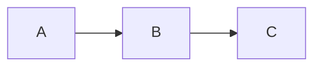

<head>
  
  
</head>

竹雄（[takeo1116](https://twitter.com/takeo1116)）のホームページです。

現在、[旧ページ](https://takeo1116.sakura.ne.jp/)からコンテンツを移行中

## コンテンツ

- 競技プログラミング関係（移行中）
- [量子情報関係](./quantum/index.md)
- [機械学習関係](./machinelearning/index.md)

## テスト

