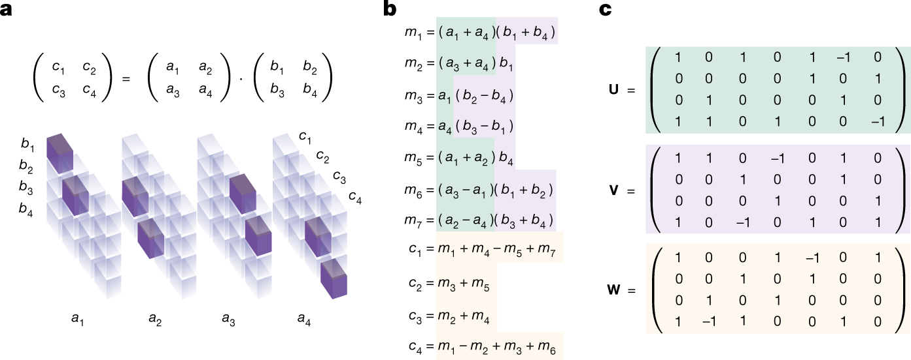
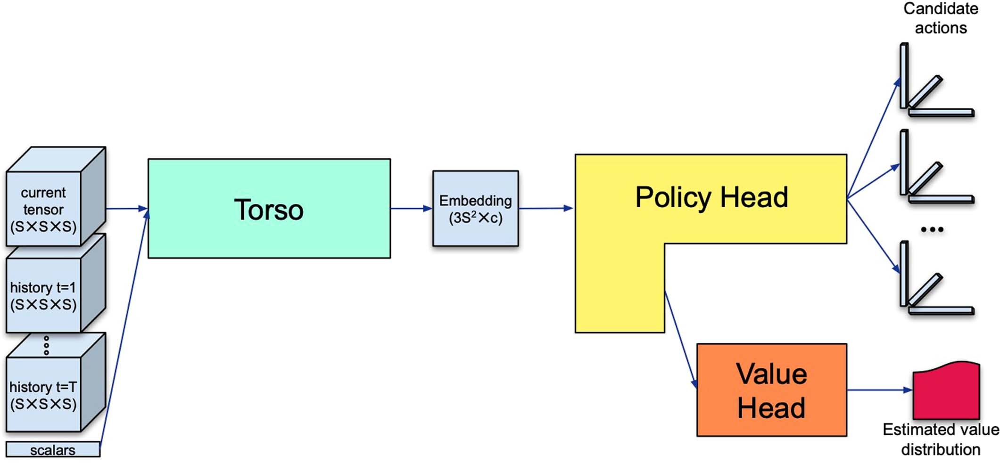

# AlphaTensor

## 参考論文
[Discovering faster matrix multiplication algorithms with reinforcement learning](https://www.nature.com/articles/s41586-022-05172-4)

## 概要

DeepMindがAlphaGOの後継として作成したAlphaTensorが、強化学習によって行列積の計算を高速化したという論文を読んでみる。

## 既存のアルゴリズム

### 定義

行列積の愚直な計算方法は、各行と列に対して定義通りに計算していくものである。

$$
\left(
    \begin{array}{rr} 
        a_{11} & a_{12} & a_{13} \\
        a_{21} & a_{22} & a_{23} \\
        a_{31} & a_{32} & a_{33} \\
    \end{array}
\right)
\left(
    \begin{array}{rr} 
        b_{11} & b_{12} & b_{13} \\
        b_{21} & b_{22} & b_{23} \\
        b_{31} & b_{32} & b_{33} \\
    \end{array}
\right)
=
\left(
    \begin{array}{rr} 
        a_{11}b_{11} + a_{12}b_{21} + a_{13}b_{31} & a_{11}b_{12} + a_{12}b_{22} + a_{13}b_{32} & a_{11}b_{13} + a_{12}b_{23} + a_{13}b_{33} \\
        a_{21}b_{11} + a_{22}b_{21} + a_{23}b_{31} & a_{21}b_{12} + a_{22}b_{22} + a_{23}b_{32} & a_{21}b_{13} + a_{22}b_{23} + a_{23}b_{33} \\
        a_{31}b_{11} + a_{32}b_{21} + a_{33}b_{31} & a_{31}b_{12} + a_{32}b_{22} + a_{33}b_{32} & a_{31}b_{13} + a_{32}b_{23} + a_{33}b_{33} \\
    \end{array}
\right)
$$

$N\times N\times N$行列どうしの積であれば、乗算の回数は$N^3$回となる。

### シュトラッセンのアルゴリズム

シュトラッセンのアルゴリズムはフォルカー・シュトラッセン（人間）により開発されたアルゴリズムであり、行列を4つの部分行列に分けたうえで、その積を高速に計算するアルゴリズムである（愚直にやると8回発生する部分行列の乗算が7回になっている）

$$
\left(
    \begin{array}{rr} 
        A_{11} & A_{12} \\
        A_{21} & A_{22} \\
    \end{array}
\right)
\left(
    \begin{array}{rr} 
        B_{11} & B_{12} \\
        B_{21} & B_{22} \\
    \end{array}
\right)
=
\left(
    \begin{array}{rr} 
        P_1 + P_4 - P_5 + P_7 & P_3 + P_5 \\
        P_2 + P_4 & P_1 + P_3 - P_2 + P_6 \\
    \end{array}
\right)
$$

ここで

$$
\begin{align*}
P_1 &= (A_{11} + A_{22})(B_{11} + B_{22}) \\
P_2 &= (A_{21} + A_{22})B_{11} \\
P_3 &= A_{11}(B_{12} - B_{22}) \\
P_4 &= A_{22}(B_{21} - B_{11}) \\
P_5 &= (A_{11} + A_{12})B_{22} \\
P_6 &= (A_{21} - A_{11})(B_{11} + B_{12}) \\
P_7 &= (A_{12} - A_{22})(B_{21} + B_{22}) \\
\end{align*}
$$

である（参考：[Wikipedia](https://ja.wikipedia.org/wiki/%E3%82%B7%E3%83%A5%E3%83%88%E3%83%A9%E3%83%83%E3%82%BB%E3%83%B3%E3%81%AE%E3%82%A2%E3%83%AB%E3%82%B4%E3%83%AA%E3%82%BA%E3%83%A0)）

$4\times4$行列の積であれば、シュトラッセンのアルゴリズムを再帰的に適用することで計算できる。具体的には、7回の部分行列の乗算それぞれに対して7回の乗算が発生することとなり、合計は49回となる（愚直解の64回よりも速い）

これは論文中で「Strassen’s two-level algorithm」と呼ばれているもののことであり、これを世界で初めて改良したと主張されている。

## TensorGame

TensorGameは、効率のよい行列積の求め方を見つける手順をゲームに落とし込んだものである。

### 演算のテンソル表示

||
|:--:|
|*Matrix multiplication tensor and algorithms. （[参考論文](https://www.nature.com/articles/s41586-022-05172-4) より引用）*|

行列積のアルゴリズムを組み立てるにあたって、現在の状態を表すための方法を必要である。TensorGameでは、3次元テンソルを使って現在の状態を表している。引用画像aは$2\times2$行列の積

$$
\left(
    \begin{array}{rr} 
        c_{1} & c_{2} \\
        c_{3} & c_{4} \\
    \end{array}
\right)
=
\left(
    \begin{array}{rr} 
        a_{1}b_{1} + a_{2}b_{3} & a_{1}b_{2} + a_{2}b_{4} \\
        a_{3}b_{1} + a_{4}b_{3} & a_{3}b_{2} + a_{4}b_{4} \\
    \end{array}
\right)
$$

を表している。
画像a内で$T(a_{i}, b_{j}, c_{k})$が紫($=1$)になっているとき、$c_{k}$に$a_{i}b_{j}$の項が含まれることを意味する。行列積の各要素はすべて$a_{i}b_{j}$の形の線形結合で表せるため、この方法で行列の積を表すことが可能である（当然、3次元テンソルの各要素はゲーム中に0,1以外の値も取りうる）

TensorGameをプレイするにあたって、最終的に得たいのは引用画像b（これはシュトラッセンのアルゴリズム）のように、Aの要素とBの要素の線形結合どうしをかけ合わせて、それをさらに足し合わせるというような形式であり、このような形式の中で最も乗算の回数（つまり、$m$の個数）の小さいような形式を求めたい。

引用画像cはいわば棋譜であり、$u, v, w$の各列が一手に対応する。これはTensorGameにおいてシュトラッセンのアルゴリズムを発明する際の手順の例を表しているが、一手目で

$$
u=
\left(
    \begin{array}{rr} 
        1 \\ 0 \\ 0 \\ 1
    \end{array}
\right),\;
v=
\left(
    \begin{array}{rr} 
        1 \\ 0 \\ 0 \\ 1
    \end{array}
\right),\;
w=
\left(
    \begin{array}{rr} 
        1 \\ 0 \\ 0 \\ 1
    \end{array}
\right)
$$

を指しており、これは現在の状態に

$$
\left(
    \begin{array}{rr} 
        1 \\ 0 \\ 0 \\ 1
    \end{array}
\right)
\otimes
\left(
    \begin{array}{rr} 
        1 \\ 0 \\ 0 \\ 1
    \end{array}
\right)
\otimes
\left(
    \begin{array}{rr} 
        1 \\ 0 \\ 0 \\ 1
    \end{array}
\right)
$$

つまり

$$
a_1=
\left(
    \begin{array}{rr} 
        1 & 0 & 0 & 1 \\
        0 & 0 & 0 & 0 \\
        0 & 0 & 0 & 0 \\
        1 & 0 & 0 & 1 \\
    \end{array}
\right),\;
a_2=
\left(
    \begin{array}{rr} 
        0 & 0 & 0 & 0 \\
        0 & 0 & 0 & 0 \\
        0 & 0 & 0 & 0 \\
        0 & 0 & 0 & 0 \\
    \end{array}
\right),\;
a_3=
\left(
    \begin{array}{rr} 
        0 & 0 & 0 & 0 \\
        0 & 0 & 0 & 0 \\
        0 & 0 & 0 & 0 \\
        0 & 0 & 0 & 0 \\
    \end{array}
\right),\;
a_4=
\left(
    \begin{array}{rr} 
        1 & 0 & 0 & 1 \\
        0 & 0 & 0 & 0 \\
        0 & 0 & 0 & 0 \\
        1 & 0 & 0 & 1 \\
    \end{array}
\right)
$$

を足し合わせることを意味する。このように、TensorGameの一手とは、行列A, Bからそれぞれいくつかの要素を選び、その線形結合の積をCのいくつかの要素に足すという操作を表す。

ただし、学習時には引用画像aのような行列積の正しい解をスタート、0テンソルをゴールに設定している（逆順でプレイしている）ため、プレイ中には各手は足し算ではなく引き算の操作になる。

## 学習の手法

学習の際には、AlphaZeroの手法をTensorGameに適用するためにいくつかの工夫がされている。

### 報酬

乗算の回数を最小化することを目指す場合は、一手ごとに-1のペナルティを設定する。さらに、ペナルティの上限$R_{rimit}$を設定し、一定以上の手数を過ぎるとゲームを失敗扱いにして強制終了する。

なお、GPU上で実際にその計算をシミュレートする場合にかかった時間そのものをペナルティとすることも可能であり、その場合は個々のGPUに最適化された行列積のアルゴリズムを見つけることも可能である。

### 行動空間について

各アクションでは、それぞれの要素の係数を$F=\{-2, -1, 0, 1, 2\}$から選択しているが、このとき行動空間が非常に大きくなってしまう。たとえば$2\times2$行列どうしの積であれば、一手ごとに12個の係数を選択するので$5^{12}=244140625$種類のアクションがある。このような場合に適用できる手法として、Sampled AlphaZeroがある。これは[Sampled MuZero](https://arxiv.org/abs/2104.06303)として発表された手法であり、サンプリングされたアクションを用いてプレイアウトを行い、その結果を用いて統計的に方策を学習するテクニックである。

係数の範囲を絞ってしまうとその範囲の外にあるアルゴリズムを発見できなくなってしまうことが考えられるが、これを回避するために基底のランダム化を行っている。行列の演算は標準規定のほかにも様々な基底を用いて書くことができるが、ある基底を用いて書かれた演算を別の基底に直すことは容易であるため、ランダムに生成された基底を用いてゲームをプレイし、それを標準規定に直して学習する（もしくはカスタム基底に直してプレイする）ことで係数が$F$の外にあるアルゴリズムも見つけることができる。最適なアルゴリズムは、ランダムで生成されたどれかの基底で見つかれば充分である。

### データの増補

TensorGameの結果は手の順序によらず不変であるため、成功したゲームがあれば、そのゲームの最後のアクションを他のランダムなアクションと入れ替えることで成功パターンの学習データを増やすことができる。

## モデル

||
|:--:|
|*AlphaTensor’s network architecture.（[参考論文](https://www.nature.com/articles/s41586-022-05172-4) より引用）*|

基本的な構造はAlphaZeroを踏襲しており、共通部分であるTorsoと、各アクションの確率分布を出直するPolicy Head、状態の価値を出力するValue Headで構成されている。

### 入力

入力として与えられる情報は

- 状態テンソル（ここでは簡単のため$S\times S\times S$）
- $T$手前までの状態（通常は$T=7$）
- 現在のターン数

を含む。

参考論文に、[Torso, Policy Head, Value Headの詳細なアーキテクチャを示す図](https://www.nature.com/articles/s41586-022-05172-4/figures/9)が掲載されている。さらに、[Appendix](https://static-content.springer.com/esm/art%3A10.1038%2Fs41586-022-05172-4/MediaObjects/41586_2022_5172_MOESM1_ESM.pdf)に各部分の詳細な処理が掲載されている。

### Torso

入力を3つのグリッドからなる中間表現に変換する。テンソルの各軸を$U, V, W$とすると、各グリッドは$(U, V), (V, W), (W, U)$の2軸の組み合わせに関連付けられる。各グリッドの初期値は$S\times S\times (TS+1)$のテンソルである（$T$個の入力状態を各面から見たもの＋スカラー入力を線形層で変換した情報）

それぞれのグリッドを線形層によって$c$チャンネルに変換し、Attentive modesブロックによって8回変換する。Attentive modesブロックでは、各グリッドの組み合わせに対して結合を行い、軸方向にaxial attentionを実行する。

最終的にはサイズ$3S\times c$の中間表現としてPolicy Headに入力される。

### Policy Head

TensorGameでの一手は$3S$個の係数で表されるが、AlphaTensorではこれを$d$桁のトークン$k$個に分割して、Transformerのアーキテクチャを用いて推論している。

つまり、あたかもTransformerで$k$単語の文章を生成するかのように$k$回の推論を行い、得られた$d$桁のトークンを繋ぎ合わせることで$3S$桁のアクションとして扱っている。

また、Policy Headの最初のトークンを生成する際に、最後の線形レイヤーの直前の特徴量がValue Headに流されている。

### Value Head

Value Headでは、Policy Headから受け取った特徴量をもとに何層かの線形層を作用させ、$q$個の値を出力する。これは$q$個の分位数の予測値であり、推論時には75％（中心から左右に32.5％？）の値の平均値を用いている。

### 結果

$4\times4$行列どうしの積について、乗算の回数47回のアルゴリズムを発見した。そのほかにも、いくつかの大きさの行列積について、現状知られているものよりも少ない回数の乗算で計算できるアルゴリズムを発見した。

また、特定のGPUおよびTPUについてチューニングされたアルゴリズムを発見し、既存のアルゴリズムの速度を数パーセント改善した。

## その他

アルゴリズムの変更によって行列積以外のタスクにも適用できると論文には書かれているが、今回は読んでいない。