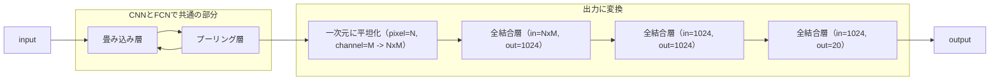
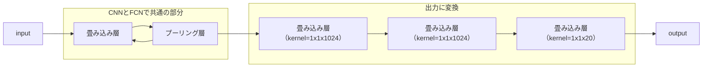

# CNN(Convolutional Neural Network)

CNN(畳み込みニューラルネットワーク)は
- 畳み込み層
- プーリング層
- (全結合層)

からなるニューラルネットワークの総称。

## 概要
入力は主に画像や動画など
- 囲碁の盤面を符号化したものなど、画像に準ずるものにも使われたりする

画像の特徴を識別し、空間的な位置のずれや形状の差異などを吸収できることが特長であるといえる。

CNN以前には、画像を入力とする際には何らかの方法でピクセルを特徴量に変換する工程が必要であったが、CNNでは画像そのものを入力として用いることができ、各ピクセルの位置関係なども考慮した学習を行うことができる。

## 畳み込み層
サイズW×Hの画像に対して、サイズw×hのカーネル（フィルタ）を動かしながら各位置の情報を取得し、特徴マップを出力する。
カーネル適用後の各セルの値は

$$ output_{x, y} = \sum_{i,j}^{w,h} input_{x+i, y+j} * kernel_{i,j} + bias_{x, y}$$

で表される。カーネルを適用するたびに画像のサイズが$(w-1, h-1)$ずつ小さくなっていくが、入力画像に対してpaddingを行うことで出力のサイズを調整することができる。

- Zero Padding
    - 画像の周囲を0で埋める

いくつものカーネルを適用することで、様々な特徴を捉えた特徴マップを得ることができるようになる。

### 入力チャンネル数と出力チャンネル数（カーネル数）について

畳み込み層では入力される画像は複数のチャンネルを持つことが一般的であるが、入力チャンネル数が$in$チャンネル、出力チャンネル数が1であれば、$in$枚のチャンネルについて異なるカーネルを1セット用意し、それぞれの出力を各ピクセルで足し合わせたものを出力する。ここで出力チャンネル数が$out$であれば、カーネル自体は$in\times out$枚あり、それぞれのセットを使って計算した特徴マップを$out$枚出力する。

慣例として「1セット」のフィルタのことを「1枚」と呼ぶことがあるらしく、ややこしい。

## プーリング層

プーリング層は、画像の特徴を残して縮小（ダウンサンプリング）を行うことで入力のずれや平行移動の影響を吸収するはたらきがある。

- Max Pooling
    - カーネルをスライドさせ、各位置でカーネル内のセルの最大値を並べたものをoutputとする。
- Average Pooling
    - カーネルをスライドさせ、各位置でカーネル内のセルの平均値を並べたものをoutputとする。

CNNの場合には、カーネルのサイズとストライド幅を共に$2\times 2$とすることが多い（重なりなしプーリング）が、重なりありのプーリングを用いる場合もある。

## 全結合層

CNNの構成として必須ではないが、一般には特徴マップを希望の形の出力に変形するために全結合層を用いる場合が多い。たとえば回帰であれば単一の値に、クラス分類であればクラスの数だけのoutputに変形する。

# FCN(Fully Convolution Network)

FCNはCNNの一種であるが、全結合層をもたず、畳み込み層のみで構成されているという点が特徴である。

## 概要

CNNでは出力層付近に全結合層をもっていたが、FCNではこれをカーネルサイズが1×1の畳み込み層に置き換える。

全結合層を畳み込み層に置き換えるとは、たとえば20クラス分類のCNNでは

のようになっていた処理を、FCNでは

のようにするということである。

この例では出力は20枚の特徴マップになっており、各特徴マップの各ピクセルの値は、入力画像における位置とそれぞれの特徴を対応付けている。クラス分類の例でいえば、1番目の特徴マップの真ん中あたりの値が大きければ入力画像の真ん中あたりに1番目のクラスが示すオブジェクトが映っている確率が大きいと解釈できる、といったことである。

ここで、FCNが行っていることは、CNNが入力画像そのものに対して計算していた各特徴量の大きさを各ピクセルに対して個別に計算すること（各ピクセルを1x1の画像とみなして各特徴量の大きさを計算すること）であり、サイズ1x1のカーネルを用いた畳み込みは特徴マップの各ピクセルについて全結合層を用いた変換を行っているのと等価である。

一般には畳み込み層＋プーリング層を通すことで特徴マップは入力画像より小さくなっているため、入力のピクセルと1対1対応にはならないが、逆畳み込みを用いて出力される特徴マップを入力画像と同じサイズにアップサンプリングすれば、入力画像の各ピクセルがどのクラスに属しているかを推論することも可能である。