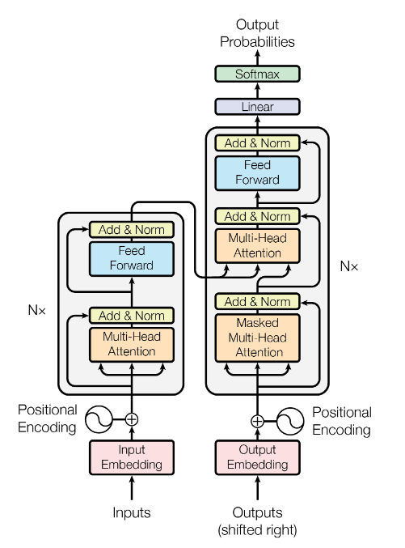
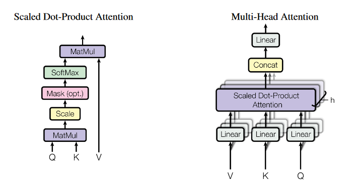

# Transformer

## 参考論文
[Attention Is All You Need](https://arxiv.org/abs/1706.03762)

## 概要

Transformerは2017年の論文「Attention Is All You Need」で発表されたモデルであり、自然言語処理（とくに翻訳）の分野で開発された手法である。しかし、その汎用性から自然言語処理以外にも様々な分野に応用されている。

## モデル

||
|:--:|
|*The Transformer - model architecture （[参考論文](https://arxiv.org/abs/1706.03762) より引用）*|

Transformerのモデルは、大きくEncoderとDecoderの2部分に分けられ、その構造は上図のようであり、その中でもMulti-Head Attentionは以下のようなアーキテクチャである。

||
|:--:|
|*(left) Scaled Dot-Product Attention. (right) Multi-Head Attention consists of several
attention layers running in parallel. （[参考論文](https://arxiv.org/abs/1706.03762) より引用）*|

### Inputs・Embedding(Encoder)

機械翻訳の文脈においては、エンコーダ入力は複数の単語からなる文章（翻訳したい文章）である。
各単語にはユニークな番号が与えられているが、これをone-hot表現でそのまま入力すると次元数が膨大になってしまうため、線形層を通して次元数を削減する。

たとえば単語が5種類あり、番号4が与えられている単語であれば

$$
    \left(
        \begin{array}{cc} 
           0 & 0 & 0 & 1 & 0
        \end{array}
    \right)
    W
    =
    \left(
        \begin{array}{cc} 
           0.1 & 0.2 & 0.3
        \end{array}
    \right)
$$

のように変換できる。各単語がベクトルで表せるので、文章は単語ベクトルを縦に並べた行列として表すことができる。

### Inputs・Embedding(Decoder)

Transformerで文章を生成する場合は1単語ずつ生成していくので、Decoderの入力はこれまでに生成した単語のリスト（書いている途中の文章）になる。

### Positional Encoding

Transformerのモデルでは基本的に各単語が独立に処理されるため、文章において何番目の単語かという情報をそれぞれの単語に乗せておく必要がある。Positional Encodingでは単語の位置に応じてユニークなベクトル（三角関数を用いて生成）を入力に足し合わせることで位置の情報を乗せている。

### Scaled Dot-Product Attention

Scaled Dot-Product Attentionは、入力$Q, K, V$に対して

$${\rm Attention} (Q, K, V)={\rm softmax}(\frac{QK^T}{\sqrt{d_k}})V$$

という演算で表されるアーキテクチャである。

$Q, K, V$はそれぞれ複数のベクトルからなる行列であり、それぞれ

$$
Q=
\left(
    \begin{array}{cc} 
        \vec{q}_1 \\ \vec{q}_2 \\ \vdots \\ \vec{q}_n
    \end{array}
\right),\;
K=
\left(
    \begin{array}{cc} 
        \vec{k}_1 \\ \vec{k}_2 \\ \vdots \\ \vec{k}_n
    \end{array}
\right),\;
V=
\left(
    \begin{array}{cc} 
        \vec{v}_1 \\ \vec{v}_2 \\ \vdots \\ \vec{v}_n
    \end{array}
\right)
$$

のように表すことができる。また

$$
\begin{align*}
    QK^T &= 
    \left(
        \begin{array}{cc} 
            \vec{q}_1 \\ \vec{q}_2 \\ \vdots \\ \vec{q}_n
        \end{array}
    \right)
    \left(
        \begin{array}{cc} 
            \vec{k}_1^T & \vec{k}_2^T & \dots & \vec{k}_n^T
        \end{array}
    \right) \\
    &=
    \left(
        \begin{array}{cc} 
            \vec{q}_1\cdot\vec{k}_1 & \vec{q}_1\cdot\vec{k}_2 & \cdots & \vec{q}_1\cdot\vec{k}_n\\
            \vec{q}_2\cdot\vec{k}_1 & \vec{q}_2\cdot\vec{k}_2 &        & \vec{q}_2\cdot\vec{k}_n \\
            \vdots &        & \ddots & \vdots \\
            \vec{q}_n\cdot\vec{k}_1 & \vec{q}_n\cdot\vec{k}_2 & \cdots & \vec{q}_n\cdot\vec{k}_n
        \end{array}
    \right)
\end{align*}
$$

であり、$QK^T$の各行は、各$\vec{q}$のそれぞれの$\vec{k}$に対する内積（類似度）のベクトルとなっている。また、あるベクトル$\vec{p}$に対して

$$
\begin{align*}
    \vec{p}V &=
    \left(
        \begin{array}{cc} 
            p_1 & p_2 & \dots & p_n
        \end{array}
    \right)
    \left(
        \begin{array}{cc} 
            \vec{v}_1 \\ \vec{v}_2 \\ \vdots \\ \vec{v}_n
        \end{array}
    \right) \\
    &= \sum_i p_i\vec{v}_i
\end{align*}
$$
である。

よって、${\rm softmax}(\frac{QK^T}{\sqrt{d_k}})V$は行列であり、その$i$行目は「$\vec{q}_i$と各$\vec{k}$の類似度に応じた係数で$\vec{v}$を足し合わせたベクトル」となっていると考えることができる。

このとき、$K_d$の次元$d_k$が大きいと性能が下がってしまう（内積が大きくなってsoftmaxの結果が極端になってしまう？）ため、$\sqrt{d_k}$でスケールしているとのこと。

### Multi-Head Attention

Multi-Head AttentionはTransformerにおいて重要なはたらきをもつアーキテクチャであり、内部に複数（Transformerにおいては8つ）のScaled Dot-Product Attentionをもつ。

Multi-Head Attentionでは$Q, K, V$をそれぞれ線形層によって変換してからScaled Dot-Product Attentionに入力している。Transformerでは$Q, K, V$にすべて同じデータを入力しており、次元を$\frac18$に削減してから8つのScaled Dot-Product Attentionに遠し、最後にconcatしている。

### Masked Multi-Head Attention

Decoder部の最初のMulti-Head Attentionでは、Scaled Dot-Product AttentionのMask層がONになっており、これによってDecoderの入力のうち、今まで生成した単語より後の単語の情報をブロックしている（学習時には翻訳後の全文（答え）を全部入力しているから、ということ？）

### FeedForward

TransformerにおけるFeedForward層は

Linear -> ReLU -> Linear

という比較的単純な構成である。Transformerは基本的に線形層でできているので、非線形変換を行う部分として導入されていると思われる。

### Add & Norm

各層をまたぐように残差接続（Residual Connection）があり、同時にlayer normalizationの処理が行われている。

### Output Probabilities

出力は、次の単語の選ばれる確率である。デコーダからの出力が線形層とsoftmax層を通して確率に変換される。

## 結果

WMT 2014の英->独翻訳タスクで、BLEUスコア28.4を獲得した。さらに、英->仏翻訳タスクではBLEUスコア41.0を出した。どちらも以前に発表されたどのモデルよりも優秀だった。