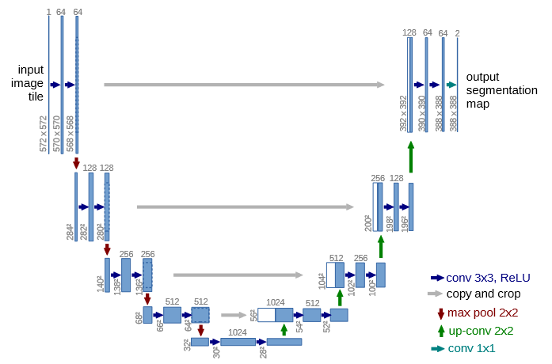

# U-Net

## 参考論文
[U-Net: Convolutional Networks for Biomedical Image Segmentation](https://arxiv.org/abs/1505.04597)

## 概要

[FCN](./cnn.md)では出力が複数枚の特徴マップであり、特徴マップの各ピクセルは入力画像の対応する位置でのその特徴の量を表していた。しかし、畳み込み層およびプーリング層におけるダウンサンプリングによって特徴マップは入力画像より小さくなっているため、入力画像の各ピクセルに対して特徴量を求めることはできなかった。

U-NetはFCNの構造をもとにしたネットワークであり、逆畳み込み（転置畳み込み）を用いて特徴マップを入力画像と同じサイズまでアップサンプリングすることで入力画像と同じサイズの特徴マップを得る手法である。

## ネットワーク構造

||
|:--:|
|*U-Netの構造 （[参考論文](https://arxiv.org/abs/1505.04597) より引用）*|

U-Netの構造は、エンコーダと呼ばれる前半部とデコーダと呼ばれる後半部に分けられる。エンコーダ部は構造としてはCNNであり、畳み込み層とmax pooling層を用いて画像をダウンサンプリングして特徴マップを得る機能をもつ。

3x3畳み込み層 -> 3x3畳み込み層 -> 2x2プーリングという繰り返しになっており、プーリングで画像の縦横サイズが半分となる代わりに直後の畳み込み層ではカーネル数が2倍となっている。

一方でデコーダ部では逆畳み込み（転置畳み込み）を用いてアップサンプリングを行うことで特徴マップを拡大する。

### 逆畳み込み

畳み込み層ではサイズn×nのカーネルを使用すると特徴マップのサイズが縦横それぞれn-1ずつ減少する。paddingを行えば画像をある程度大きくすることも可能ではあるが、左右にカーネルサイズ以上拡張しても値が0となるため無意味である。

逆畳み込みは、もとの特徴マップに含まれるピクセルを疎に配置した画像に対して畳み込みを行うことで大きな出力画像を得る手法である。strideとpaddingの値を適切に調整することによって、出力画像の大きさを調整できるため、画像の大きさをちょうど2倍にすることも可能である。

逆畳み込みの登場以前には、アップサンプリングのために画像補間を用いたアップサンプリング層を用いていたが、計算量の観点や、同時に畳み込みの学習も行えるという効率性から逆畳み込みによるアップサンプリングが主流となったらしい。

畳み込み＋プーリングによって縮小した特徴マップを逆畳み込みによって拡大することによって入力画像と出力画像のサイズを一致させることができるが、得られた特徴マップの各ピクセルの情報は入力画像の同じ位置のピクセルとは対応しておらず、位置の情報は減衰してしまっている。

これを補完するために、U-Netではデコーダ部で画像を拡大する際に、エンコーダ部の対応する出力と結合を行っている。これにより、特徴量の情報と位置の情報をもった特徴マップを得ることができる（スキップ接続）

出力部では、FCNと同様に1x1の畳み込みを行うことによって各ピクセルでの特徴量を得ることができる。

なお、構造図では畳み込みを行うたびに画像サイズが少しずつ小さくなっており、スキップ接続の際に画像サイズが微妙に異なってしまっている。論文実装ではトリミングによって大きさを合わせているが、インターネットでU-Netの実装を調べるとpaddingによって画像サイズの減少をなくしているものが多くみられた。
